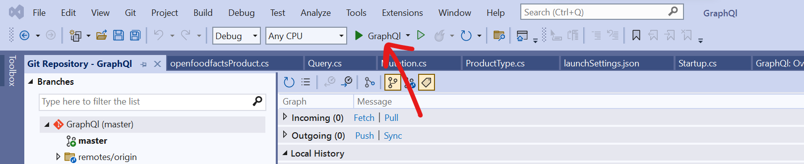

# MDS-MyGraphQl

## Get started
Download Microsoft Visual Studio 2022

Clone the repo

Open GraphQl.sln with Microsoft Visual Studio 2022

Use "GraphQl" to launch the project and not "IIS Express"



The window https://localhost:5001/graphql/ open automatically. You can make queries directly here or in any other tool

## Request

**Get all products**
```
query{
  products {
    id
    name
    stock
    code
  }
}
```

**Get product By Id :**
```
query{
    productById(id:3){
    id
    name
    stock
    code
    }
}
```

**Create Product**
```
mutation{
  createProduct(productInput: {code:8024884500409, name:"klv2", stock:10}) {
    id
    name
    stock
    code
  }
}
```

**Update Product**
```
mutation{
  updateProduct(id: 1, productInput: {code:8024884500409, name:"klv2", stock:10}) {
    id
    name
    stock
    code
  }
}
```

**Delete product**
```
mutation{
  deleteProduct(id: 11)
}
```